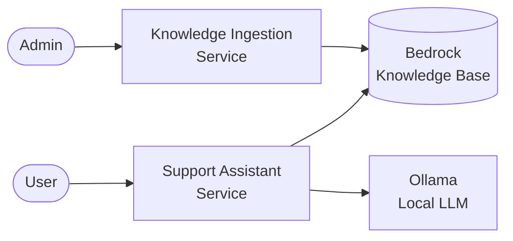
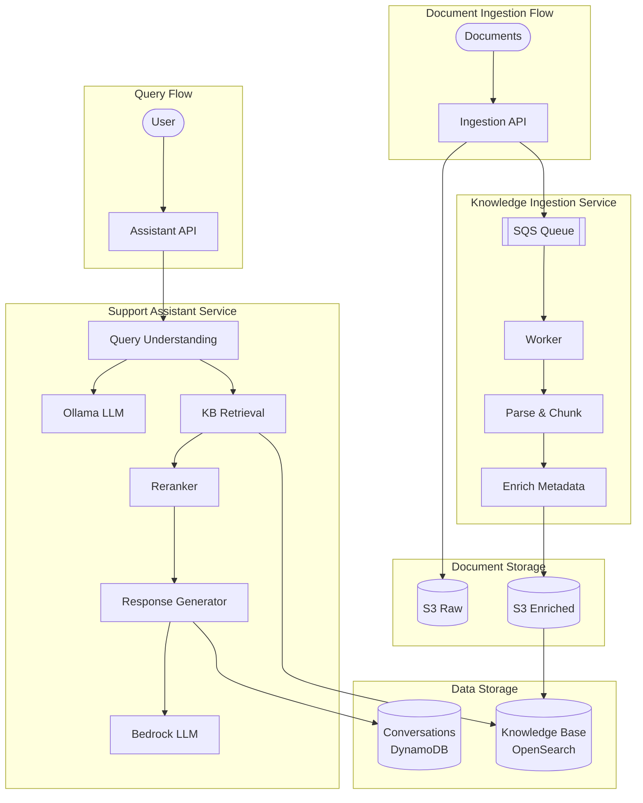

# Support Assistant App

An intelligent AI-powered support assistant system that leverages Amazon Bedrock, LangGraph, and knowledge base retrieval to provide contextual, accurate responses to support queries.

## Overview

This monorepo contains three interconnected services that work together to provide an end-to-end AI support assistant solution:

```
support-assistant-app/
├── support-assistant-service/    # Main AI assistant API
├── support-assistant-backend/    # Knowledge ingestion pipeline
└── support-assistant-ollama/     # Local LLM for query understanding
```

## Architecture

### System Overview



### Detailed Architecture



## Services

### 1. Support Assistant Service (`support-assistant-service/`)

The main conversational AI service that handles user queries.

**Key Features:**
- Intelligent query understanding and classification
- Knowledge base retrieval with semantic search
- Multi-turn conversation management
- Confidence scoring with citations
- Security guardrails for input/output validation
- Hybrid local/cloud LLM support

**Tech Stack:** FastAPI, LangGraph, Amazon Bedrock, DynamoDB

**API Endpoints:**
- `POST /api/v1/assistant/chat` - Send a message and get AI response
- `GET /api/v1/conversations/{id}` - Get conversation details
- `GET /api/v1/conversations/{id}/messages` - Get conversation history
- `POST /api/v1/conversations/{id}/close` - Close a conversation

### 2. Knowledge Ingestion Service (`support-assistant-backend/`)

Document processing pipeline that prepares support documentation for the knowledge base.

**Key Features:**
- Multi-format document parsing (PDF, JSON, CSV, Markdown, logs, text)
- Intelligent text chunking and normalization
- Metadata enrichment for filtered retrieval
- Asynchronous processing via SQS
- Bedrock Knowledge Base synchronization

**Tech Stack:** FastAPI, SQS, S3, DynamoDB, Amazon Bedrock

**Supported Formats:**
- PDF documents (via PyMuPDF)
- JSON support tickets
- CSV records
- Markdown documentation
- Log files
- Plain text

**API Endpoints:**
- `POST /api/v1/knowledge/documents` - Upload document for processing
- `POST /api/v1/knowledge/s3` - Ingest from existing S3 object
- `POST /api/v1/knowledge/s3/batch` - Batch ingest from S3 prefix
- `GET /api/v1/knowledge/jobs/{id}` - Check job status
- `POST /api/v1/knowledge/sync` - Trigger Bedrock KB sync

### 3. Ollama Service (`support-assistant-ollama/`)

Local LLM container for fast query understanding without cloud latency.

**Model:** qwen2.5:3b

**Purpose:** Provides local inference for query classification and rewriting, reducing latency and costs for preprocessing steps.

## Getting Started

### Prerequisites

- Python 3.11+
- Docker & Docker Compose
- AWS Account with appropriate permissions
- AWS CLI configured

### AWS Resources Required

1. **S3 Buckets:** Raw and enriched document storage
2. **DynamoDB Tables:** Job state and conversation storage
3. **SQS Queue:** Ingestion job queue with DLQ
4. **Bedrock Knowledge Base:** With OpenSearch Serverless vector store
5. **IAM Roles:** Service roles with appropriate permissions

### Local Development

#### Support Assistant Service

```bash
cd support-assistant-service
python -m pip install -e '.[dev]'
cp .env.example .env
# Configure .env with AWS resources
uvicorn app.main:app --host 0.0.0.0 --port 8000
```

#### Knowledge Ingestion Service

```bash
cd support-assistant-backend
python -m pip install -e '.[dev]'
cp .env.example .env
# Configure .env with AWS resources
python -m app.run_local
```

#### Ollama Service

```bash
cd support-assistant-ollama
docker build -t support-assistant-ollama:qwen2.5-3b .
docker run --rm -p 11434:11434 support-assistant-ollama:qwen2.5-3b
```

### Docker Deployment

Each service includes a Dockerfile for containerized deployment:

```bash
# Build all services
docker compose -f support-assistant-backend/docker-compose.yml up --build
```

## Configuration

### Environment Variables

See `.env.example` files in each service directory for required configuration:

| Variable | Service | Description |
|----------|---------|-------------|
| `SUPPORT_ASSISTANT_ENVIRONMENT` | Service | Environment (dev/prod) |
| `SUPPORT_ASSISTANT_AWS_REGION` | Service | AWS region |
| `SUPPORT_ASSISTANT_KNOWLEDGE_BASE_ID` | Service | Bedrock KB ID |
| `SUPPORT_ASSISTANT_ANSWER_MODEL_ID` | Service | Bedrock model for responses |
| `SUPPORT_ASSISTANT_CONVERSATION_TABLE_NAME` | Service | DynamoDB table name |
| `RAW_BUCKET` | Backend | S3 bucket for raw documents |
| `ENRICHED_BUCKET` | Backend | S3 bucket for processed chunks |
| `SQS_QUEUE_URL` | Backend | Ingestion queue URL |

## Data Flow

### Query Processing Flow

1. User sends query to Support Assistant Service
2. Query is classified and rewritten (via Ollama or Bedrock)
3. Relevant documents retrieved from Bedrock Knowledge Base
4. Documents reranked and validated
5. Response generated with citations and confidence score
6. Conversation state persisted to DynamoDB

### Document Ingestion Flow

1. Document uploaded via API or S3 reference
2. Job queued to SQS
3. Worker parses and extracts content
4. Text normalized and sanitized
5. Content chunked with metadata
6. Chunks stored to enriched S3 bucket
7. Bedrock Knowledge Base synced

## Testing

```bash
# Run unit tests for each service
cd support-assistant-service && pytest tests/unit
cd support-assistant-backend && pytest tests/unit
```

## Documentation

- [Support Assistant Service Architecture](support-assistant-service/ARCHITECTURE.md)
- [Knowledge Ingestion Architecture](support-assistant-backend/ARCHITECTURE.md)

## License

Proprietary - All rights reserved.
