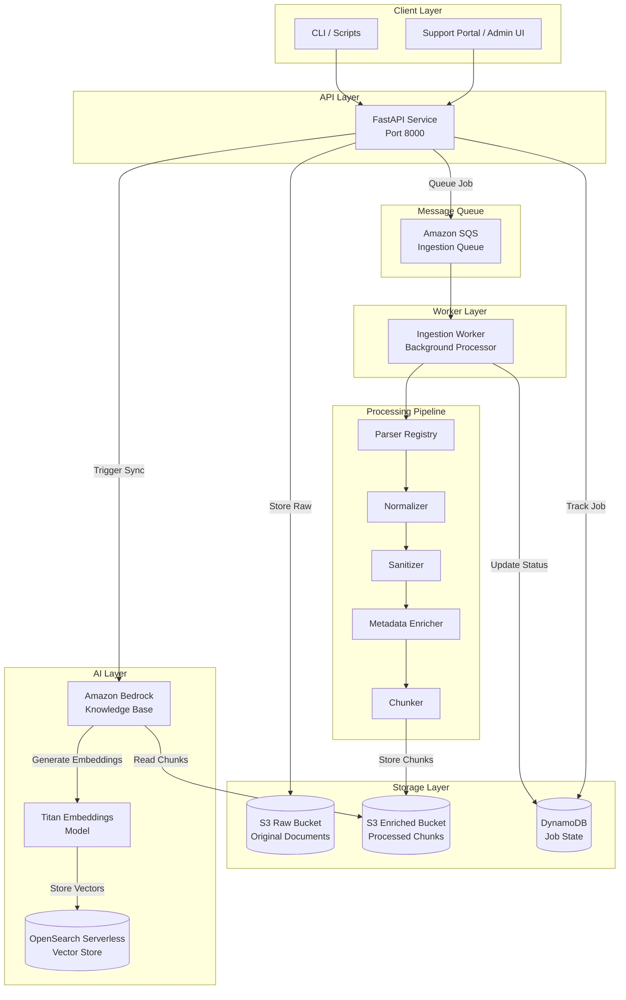
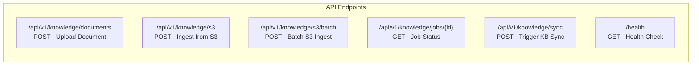
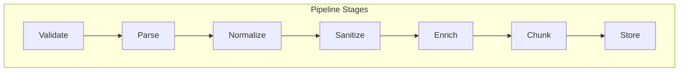
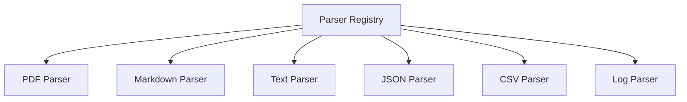
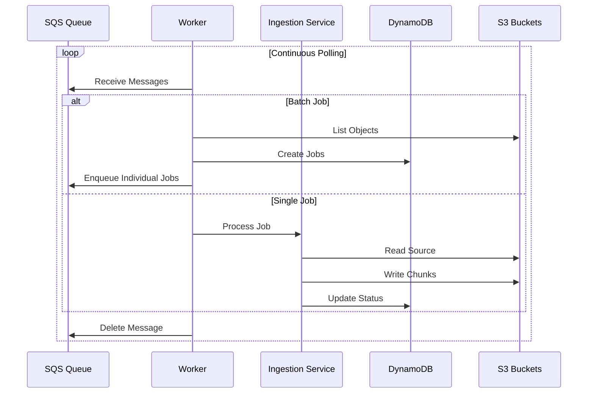
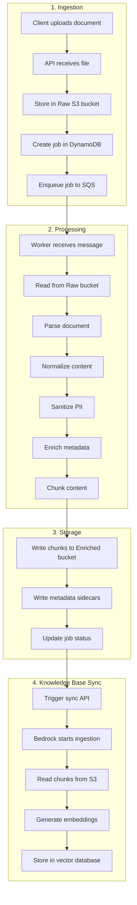
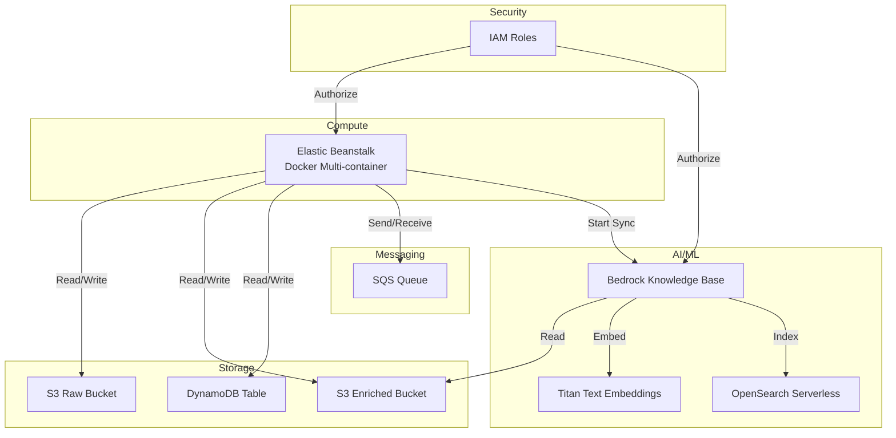
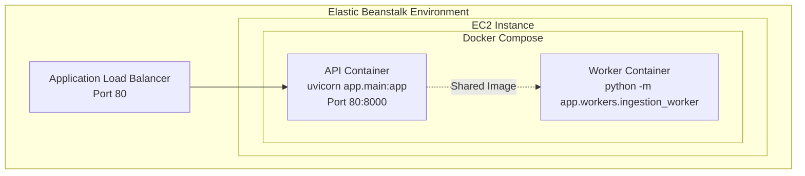
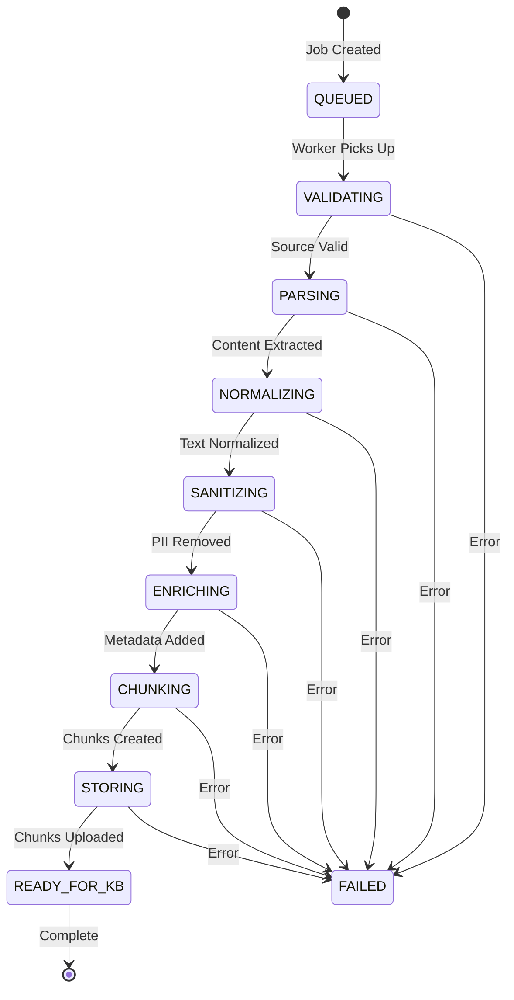

# Support Knowledge Ingestion - Architecture Documentation

## Overview

The Support Knowledge Ingestion service is a document processing pipeline designed to prepare support documentation for use with Amazon Bedrock Knowledge Bases. It transforms raw documents (PDFs, text files, Markdown, JSON, CSV, logs) into sanitized, chunked, and metadata-enriched artifacts optimized for Retrieval-Augmented Generation (RAG).

## System Architecture



## Component Architecture

### 1. API Layer (FastAPI)

The REST API provides endpoints for document ingestion and job management.



| Endpoint | Method | Description |
|----------|--------|-------------|
| `/api/v1/knowledge/documents` | POST | Upload document via multipart form |
| `/api/v1/knowledge/s3` | POST | Ingest single S3 object |
| `/api/v1/knowledge/s3/batch` | POST | Ingest all objects under S3 prefix |
| `/api/v1/knowledge/jobs/{job_id}` | GET | Get job processing status |
| `/api/v1/knowledge/sync` | POST | Trigger Bedrock Knowledge Base sync |
| `/api/v1/knowledge/sync/{sync_job_id}` | GET | Get sync job status |
| `/health` | GET | Service health check |

### 2. Processing Pipeline

Documents flow through a multi-stage processing pipeline:



#### Stage Details

| Stage | Component | Responsibility |
|-------|-----------|----------------|
| **Validate** | S3Service | Verify source exists and is accessible |
| **Parse** | ParserRegistry | Extract text content from source format |
| **Normalize** | Normalizer | Standardize whitespace, line endings, encoding |
| **Sanitize** | Sanitizer | Remove/mask PII and sensitive data |
| **Enrich** | MetadataEnricher | Add processing metadata attributes |
| **Chunk** | Chunker | Split content into optimal-size segments |
| **Store** | S3Service | Write chunks and metadata sidecars |

### 3. Parser Registry

Supports multiple document formats through pluggable parsers:



| Parser | File Types | Description |
|--------|------------|-------------|
| PDF Parser | `.pdf` | Extracts text from PDF documents |
| Markdown Parser | `.md`, `.markdown` | Preserves structure, strips formatting |
| Text Parser | `.txt` | Plain text processing |
| JSON Parser | `.json` | Structured data extraction |
| CSV Parser | `.csv` | Tabular data to text conversion |
| Log Parser | `.log` | Log file processing |

### 4. Worker Architecture

The background worker processes jobs asynchronously from the queue:



## Data Flow

### Document Ingestion Flow



### S3 Bucket Structure

```
Raw Bucket
├── raw/
│   └── {source_type}/
│       └── {document_id}/
│           └── {original_filename}

Enriched Bucket
├── enriched/
│   └── {source_type}/
│       └── {document_id}/
│           └── chunks/
│               ├── chunk-0001.txt
│               ├── chunk-0001.txt.metadata.json
│               ├── chunk-0002.txt
│               ├── chunk-0002.txt.metadata.json
│               └── ...
```

### Metadata Sidecar Format

Each chunk has an accompanying `.metadata.json` file:

```json
{
  "metadataAttributes": {
    "source_type": "uploaded_document",
    "document_type": "pdf",
    "file_type": "pdf",
    "document_id": "DOC-xxxxxxxxxxxxxxxx",
    "chunk_id": "CHK-xxxxxxxxxxxxxxxx",
    "chunk_sequence": 1,
    "source_file_name": "product_guide.pdf"
  }
}
```

## AWS Services Integration



### Required AWS Resources

| Service | Resource | Purpose |
|---------|----------|---------|
| **S3** | Raw Bucket | Store original uploaded documents |
| **S3** | Enriched Bucket | Store processed chunks for Bedrock |
| **DynamoDB** | Jobs Table | Track ingestion job state |
| **SQS** | Ingestion Queue | Decouple API from processing |
| **Elastic Beanstalk** | Docker Environment | Host API and worker containers |
| **Bedrock** | Knowledge Base | RAG retrieval system |
| **OpenSearch Serverless** | Vector Store | Store document embeddings |

### IAM Permissions Required

**EC2 Instance Role** (for Elastic Beanstalk):
- `s3:GetObject`, `s3:PutObject`, `s3:ListBucket` on both buckets
- `sqs:SendMessage`, `sqs:ReceiveMessage`, `sqs:DeleteMessage` on queue
- `dynamodb:GetItem`, `dynamodb:PutItem`, `dynamodb:UpdateItem` on table
- `bedrock:StartIngestionJob`, `bedrock:GetIngestionJob` on Knowledge Base

**Bedrock Knowledge Base Role**:
- `s3:GetObject`, `s3:ListBucket` on Enriched bucket
- `aoss:APIAccessAll` on OpenSearch Serverless collection

## Deployment Architecture



### Container Configuration

**API Container**:
- Exposes port 8000 (mapped to 80 for ALB)
- Runs FastAPI with Uvicorn
- Handles HTTP requests

**Worker Container**:
- No exposed ports
- Continuous SQS polling loop
- Processes jobs asynchronously

## Job State Machine



## Security Considerations

### Data Protection
- **PII Sanitization**: Configurable modes (MASK, REDACT, NONE)
- **S3 Encryption**: Server-side encryption enabled
- **Transit Encryption**: HTTPS for all API calls

### Access Control
- **IAM Roles**: Least-privilege access for each component
- **VPC**: Optional deployment within private subnets
- **SQS**: Queue policies restrict access to authorized principals

### Audit Trail
- **DynamoDB**: Job history with timestamps and status
- **CloudWatch Logs**: Container logs for debugging
- **S3 Access Logs**: Optional bucket access logging

## Scalability

### Horizontal Scaling
- **API**: Elastic Beanstalk auto-scaling based on load
- **Workers**: Increase worker container count or instances
- **SQS**: Automatically handles message backpressure

### Performance Tuning
- **Chunk Size**: Configurable for optimal RAG retrieval
- **Batch Processing**: Bulk S3 ingestion for large datasets
- **Connection Pooling**: boto3 session reuse

## Monitoring & Observability

### Health Checks
- `/health` endpoint for ALB health checks
- Container health monitoring via Docker

### Metrics (via CloudWatch)
- API request latency and error rates
- SQS queue depth and age
- DynamoDB read/write capacity

### Logging
- Structured JSON logging
- Container stdout/stderr to CloudWatch Logs

---

## Quick Reference

### Environment Variables

| Variable | Description |
|----------|-------------|
| `AWS_REGION` | AWS region for all services |
| `RAW_BUCKET` | S3 bucket for raw documents |
| `ENRICHED_BUCKET` | S3 bucket for processed chunks |
| `INGESTION_QUEUE_URL` | SQS queue URL |
| `DYNAMODB_TABLE` | DynamoDB table name |
| `BEDROCK_KB_ID` | Bedrock Knowledge Base ID |
| `BEDROCK_DATA_SOURCE_ID` | Bedrock Data Source ID |
| `SANITIZER_MODE` | PII handling (MASK/REDACT/NONE) |

### API Quick Start

```bash
# Upload a document
curl -X POST https://your-api/api/v1/knowledge/documents \
  -F "file=@document.pdf"

# Ingest from S3
curl -X POST https://your-api/api/v1/knowledge/s3 \
  -H "Content-Type: application/json" \
  -d '{"bucket": "my-bucket", "key": "docs/file.pdf"}'

# Check job status
curl https://your-api/api/v1/knowledge/jobs/{job_id}

# Trigger Knowledge Base sync
curl -X POST https://your-api/api/v1/knowledge/sync \
  -H "Content-Type: application/json" \
  -d '{"knowledge_base_id": "KB_ID", "data_source_id": "DS_ID"}'
```
