# Support Assistant Service - Architecture Documentation

## 📋 Table of Contents
1. [System Overview](#system-overview)
2. [High-Level Architecture](#high-level-architecture)
3. [Component Architecture](#component-architecture)
4. [Data Flow](#data-flow)
5. [Query Understanding Pipeline](#query-understanding-pipeline)
6. [Retrieval Pipeline](#retrieval-pipeline)
7. [Conversation Management](#conversation-management)
8. [Security & Guardrails](#security--guardrails)
9. [Deployment Architecture](#deployment-architecture)
10. [API Reference](#api-reference)

---

## 🎯 System Overview

The **Support Assistant Service** is an intelligent conversational AI system designed to assist users with support queries. It leverages state-of-the-art AI services to provide contextual, accurate responses backed by a knowledge base.

### Key Capabilities
- 🤖 **Intelligent Query Understanding** - Classifies and rewrites user queries for optimal retrieval
- 📚 **Knowledge Base Integration** - Retrieves relevant documents from AWS Bedrock Knowledge Base
- 💬 **Conversation Context** - Maintains multi-turn conversation state
- 🛡️ **Security Guardrails** - Input/output validation to prevent prompt injection
- 📊 **Confidence Scoring** - Provides confidence metrics with citations

---

## 🏗️ High-Level Architecture

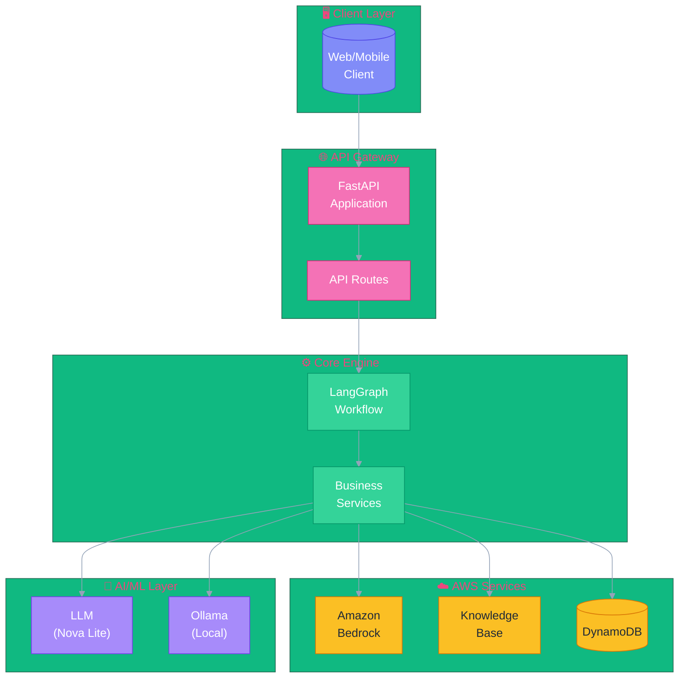

---

## 🧩 Component Architecture

### Application Structure

```mermaid
%%{init: {'theme': 'base', 'themeVariables': { 'primaryColor': '#3b82f6', 'secondaryColor': '#8b5cf6'}}}%%
graph TD
    subgraph Application["📦 support-assistant-service"]
        subgraph API["api/"]
            Routes["routes/"]
            Schemas["schemas/"]
        end
        
        subgraph Services["services/"]
            QU["Query\nUnderstanding"]
            QC["Query\nClassifier"]
            QR["Query\nRewriter"]
            ME["Metadata\nExtractor"]
            MF["Metadata\nFilter Builder"]
            RD["Retrieval\nDecision"]
            RR["Reranker"]
            EV["Evidence\nValidator"]
            LLM["LLM\nService"]
            PB["Prompt\nBuilder"]
            CM["Conversation\nManager"]
            GS["Guardrail\nService"]
        end
        
        subgraph Graph["graph/"]
            AG["Assistant\nGraph"]
            State["State\nDefinition"]
        end
        
        subgraph AWS["aws/"]
            BRC["Bedrock\nClient"]
            KBC["KB Client"]
            DBC["DynamoDB\nClient"]
        end
        
        subgraph Models["models/"]
            Conv["Conversation"]
            Retr["Retrieval"]
        end
        
        subgraph Repos["repositories/"]
            ConvRepo["Conversation\nRepository"]
        end
    end
    
    API --> Graph
    Graph --> Services
    Services --> AWS
    Services --> Models
    AWS --> Repos
    
    classDef apiStyle fill:#60a5fa,stroke:#2563eb,color:#fff
    classDef servicesStyle fill:#a78bfa,stroke:#7c3aed,color:#fff
    classDef graphStyle fill:#34d399,stroke:#059669,color:#fff
    classDef awsStyle fill:#fbbf24,stroke:#d97706,color:#1f2937
    classDef modelsStyle fill:#f472b6,stroke:#db2777,color:#fff
    
    class Routes,Schemas apiStyle
    class QU,QC,QR,ME,MF,RD,RR,EV,LLM,PB,CM,GS servicesStyle
    class AG,State graphStyle
    class BRC,KBC,DBC awsStyle
    class Conv,Retr,ConvRepo modelsStyle
```

### Directory Structure

```
support-assistant-service/
├── app/
│   ├── api/
│   │   ├── routes/          # API endpoint handlers
│   │   │   ├── assistant.py # Chat endpoint
│   │   │   ├── conversations.py
│   │   │   └── health.py
│   │   └── schemas/         # Request/Response models
│   │       ├── assistant.py
│   │       └── conversation.py
│   ├── aws/                 # AWS service clients
│   │   ├── bedrock_client.py
│   │   ├── bedrock_kb_client.py
│   │   └── dynamodb_client.py
│   ├── config/
│   │   └── settings.py      # Application configuration
│   ├── exceptions/
│   │   └── exceptions.py    # Custom exceptions
│   ├── graph/               # LangGraph workflow
│   │   ├── assistant_graph.py
│   │   └── state.py
│   ├── models/              # Domain models
│   │   ├── conversation.py
│   │   └── retrieval.py
│   ├── repositories/        # Data access layer
│   │   └── conversation_repository.py
│   ├── services/            # Business logic
│   │   ├── query_understanding.py
│   │   ├── query_classifier.py
│   │   ├── query_rewriter.py
│   │   ├── metadata_extractor.py
│   │   ├── metadata_filter_builder.py
│   │   ├── retrieval_decision.py
│   │   ├── reranker.py
│   │   ├── evidence_validator.py
│   │   ├── llm_service.py
│   │   ├── prompt_builder.py
│   │   ├── conversation_manager.py
│   │   ├── conversation_updater.py
│   │   └── guardrail_service.py
│   ├── utils/
│   │   └── logging.py
│   └── main.py              # Application entry point
├── tests/
├── Dockerfile
├── requirements.txt
├── pyproject.toml
└── README.md
```

---

## 🔄 Data Flow

### Request Processing Pipeline

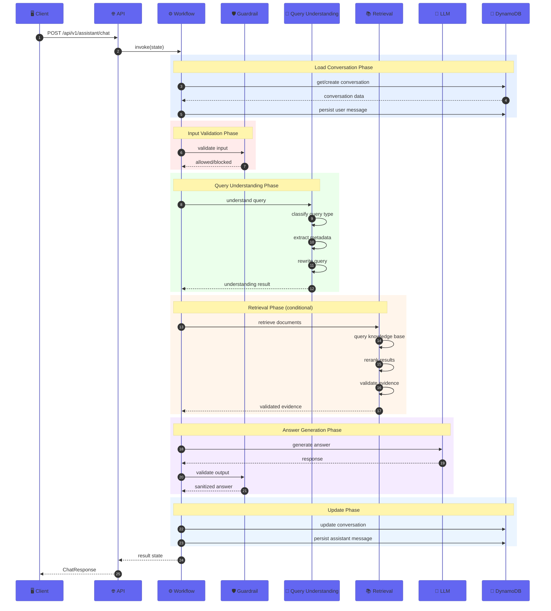

### LangGraph Workflow Nodes

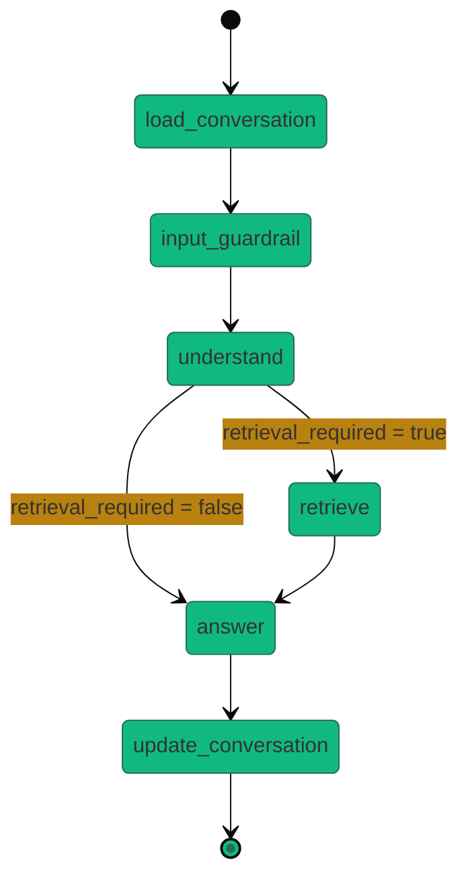

---

## 🧠 Query Understanding Pipeline

The Query Understanding system uses a **deterministic-first approach** with optional AI enhancement through local Ollama or cloud Bedrock fallback.

### Pipeline Architecture

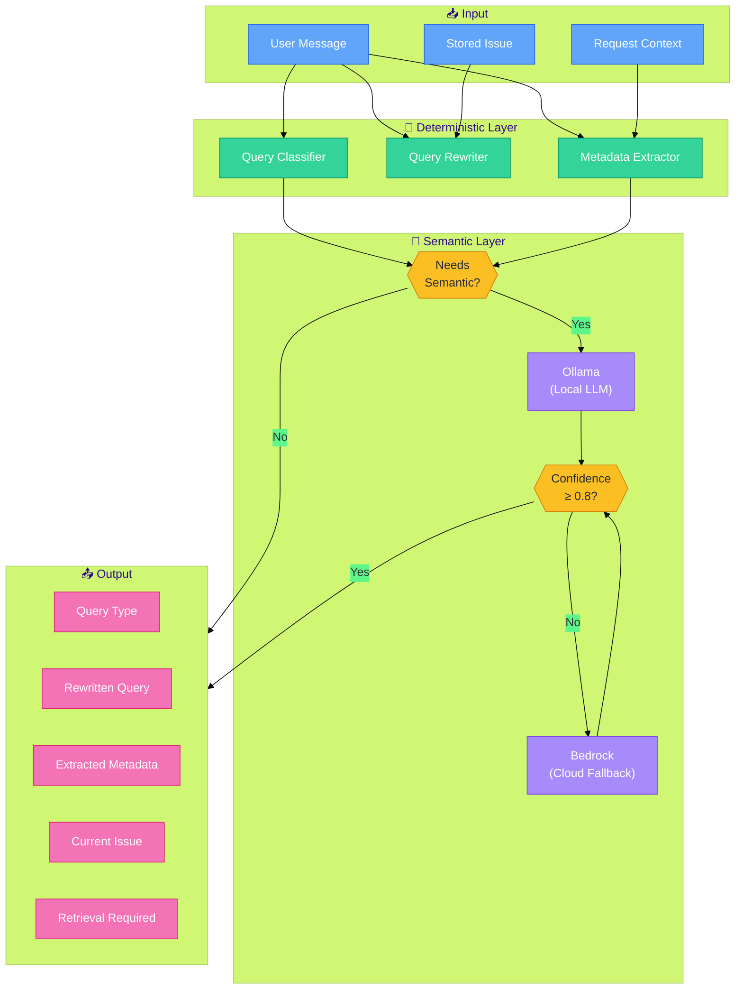

### Query Types

| Type | Description | Triggers Retrieval |
|------|-------------|-------------------|
| 🟢 `GREETING` | Social interaction | ❌ No |
| 🟢 `SUMMARY_REQUEST` | Request for conversation recap | ❌ No |
| 🟢 `CLARIFICATION` | Request to explain previous answer | ❌ No |
| 🟡 `FOLLOW_UP` | Continuation of current issue | ⚠️ Conditional |
| 🔴 `NEW_ISSUE` | New support issue reported | ✅ Yes |
| 🔴 `KNOWLEDGE_QUERY` | General knowledge question | ✅ Yes |

### Classification Logic

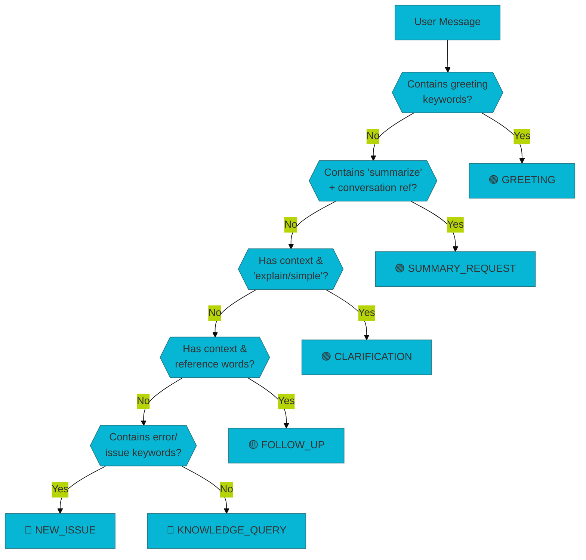

---

## 📚 Retrieval Pipeline

### Knowledge Base Integration

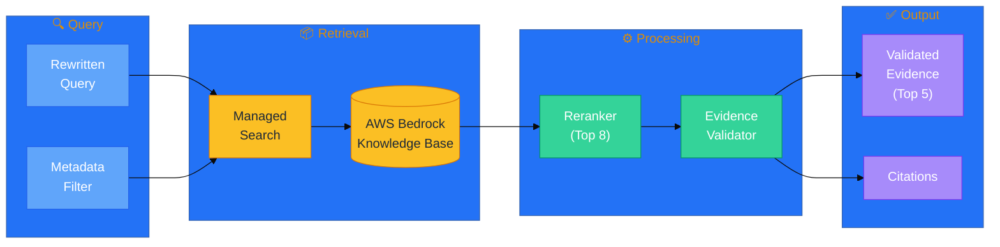

### Document Processing Flow

| Stage | Count | Description |
|-------|-------|-------------|
| **Initial Retrieval** | 25 | Raw results from Knowledge Base |
| **After Reranking** | 8 | Sorted by relevance score |
| **After Validation** | 5 | Filtered by quality criteria |

### Evidence Validation Criteria

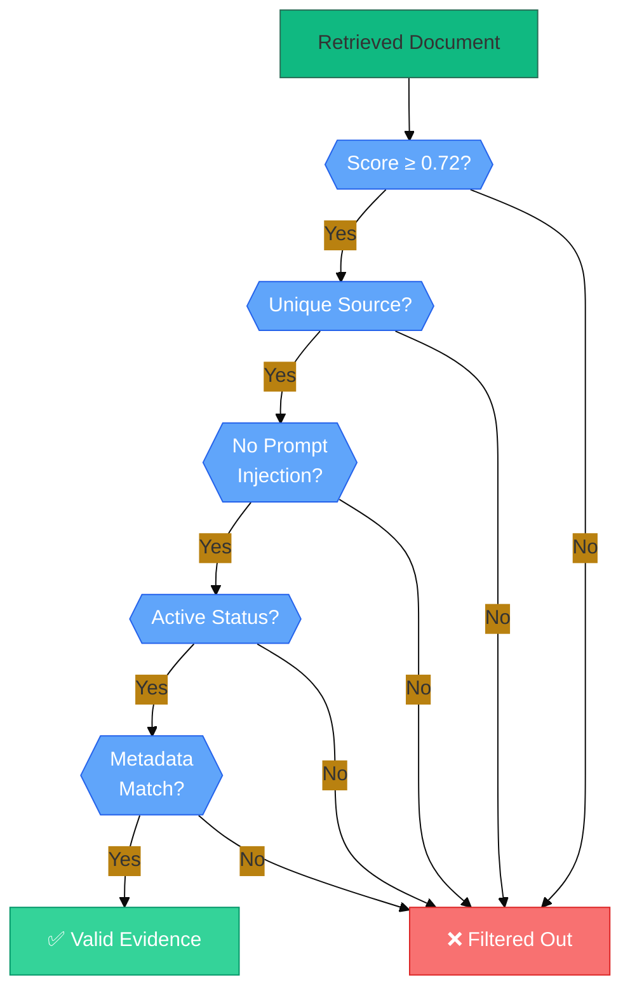

### Metadata Filter Building

Filters are constructed from **request context only** (not from conversation history) to ensure precise retrieval:

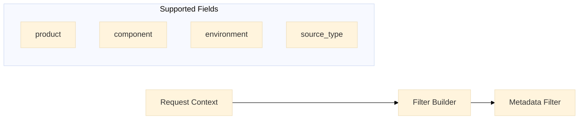

---

## 💬 Conversation Management

### State Machine

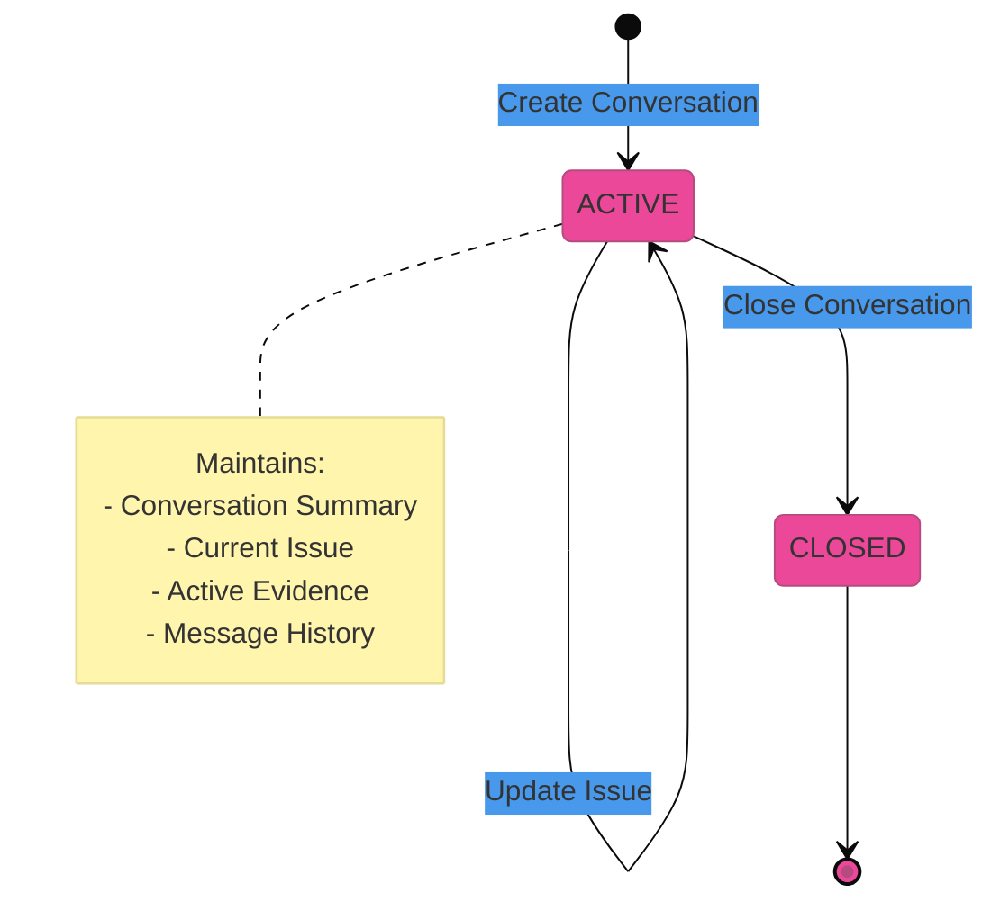

### Data Model

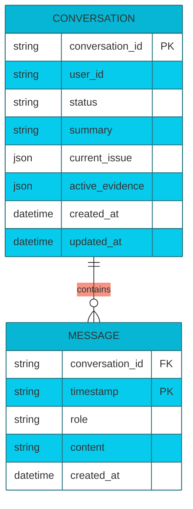

### DynamoDB Single-Table Design

| PK | SK | Attributes |
|----|----|------------|
| `CONVERSATION#{id}` | `METADATA` | status, summary, current_issue, active_evidence |
| `CONVERSATION#{id}` | `MESSAGE#{timestamp}` | role, content, created_at |

### Current Issue Management

The `current_issue` object tracks the ongoing support context:

```json
{
  "issue_summary": "503 error after deployment",
  "product": "api-gateway",
  "component": "authentication",
  "environment": "production",
  "error_code": "HTTP_503",
  "version": "2.1.0"
}
```

---

## 🛡️ Security & Guardrails

### Security Architecture

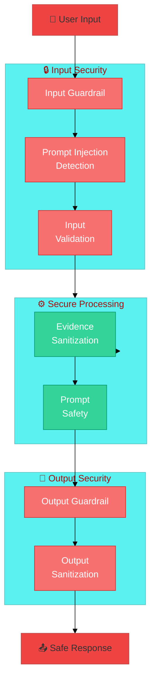

### Security Controls

| Layer | Control | Description |
|-------|---------|-------------|
| 🛡️ Input | Prompt Injection Detection | Blocks commands like "ignore all previous instructions" |
| 🛡️ Input | Pydantic Validation | Validates request schema and field constraints |
| ⚙️ Processing | Evidence Sanitization | Filters documents containing injection attempts |
| ⚙️ Processing | Untrusted Evidence Prompting | LLM instructed to treat KB content as untrusted |
| 🔐 Output | Response Sanitization | Validates and cleans generated responses |

### Blocked Patterns

- `reveal (the )?(system prompt|secrets)`
- `ignore all previous instructions`
- `ignore (all|previous)` (in documents)
- `reveal (the )?system prompt` (in documents)

---

## 🚀 Deployment Architecture

### AWS Infrastructure

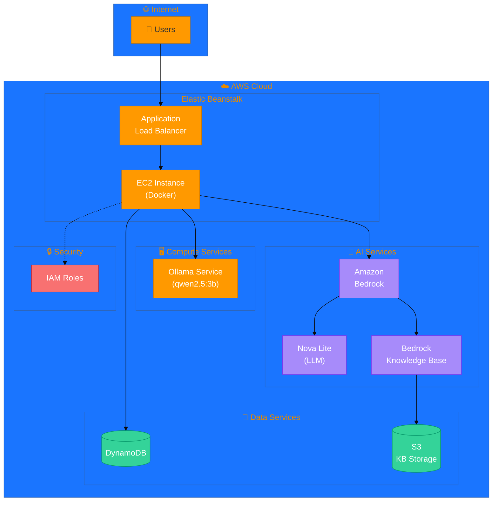

### Container Architecture

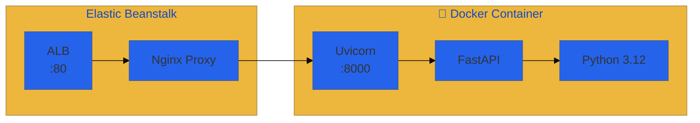

### Required IAM Permissions

| Service | Actions | Resource |
|---------|---------|----------|
| Bedrock Runtime | `bedrock:InvokeModel`, `bedrock:Converse` | `*` |
| Bedrock Agent Runtime | `bedrock:Retrieve` | Knowledge Base ARN |
| DynamoDB | `dynamodb:GetItem`, `dynamodb:PutItem`, `dynamodb:Query` | Conversation Table |

---

## 📡 API Reference

### Endpoints

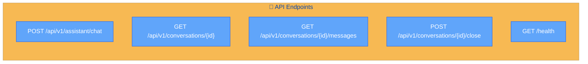

### Chat Endpoint

**POST** `/api/v1/assistant/chat`

#### Request Body

```json
{
  "conversation_id": "conv-12345",
  "user": {
    "user_id": "user-001",
    "name": "John Doe"
  },
  "message": "How do I resolve a 503 error after deployment?",
  "context": {
    "product": "api-gateway",
    "component": "authentication",
    "environment": "production"
  }
}
```

#### Response Body

```json
{
  "conversation_id": "conv-12345",
  "request_id": "REQ-abc123def456",
  "answer": "A 503 error after deployment typically indicates that the service is temporarily unavailable. Here are the recommended steps to resolve this...",
  "confidence": 0.87,
  "citations": [
    {
      "source_id": "DOC-001",
      "source_type": "product_document",
      "title": "Troubleshooting Deployment Errors",
      "relevance_score": 0.92
    }
  ],
  "metadata": {
    "query_type": "NEW_ISSUE",
    "retrieval_performed": true,
    "documents_retrieved": 25,
    "documents_reranked": 8,
    "documents_used": 3
  }
}
```

### Request Schema

| Field | Type | Required | Description |
|-------|------|----------|-------------|
| `conversation_id` | string | Yes | Unique conversation identifier |
| `user.user_id` | string | Yes | User identifier |
| `user.name` | string | No | Display name |
| `message` | string | Yes | User message (1-8000 chars) |
| `context.product` | string | No | Product filter |
| `context.component` | string | No | Component filter |
| `context.environment` | string | No | Environment filter |

### Response Schema

| Field | Type | Description |
|-------|------|-------------|
| `conversation_id` | string | Conversation identifier |
| `request_id` | string | Unique request tracking ID |
| `answer` | string | Generated response |
| `confidence` | float | Confidence score (0-1) |
| `citations` | array | Source citations |
| `metadata` | object | Processing metadata |

---

## ⚙️ Configuration

### Environment Variables

| Variable | Description | Default |
|----------|-------------|---------|
| `SUPPORT_ASSISTANT_ENVIRONMENT` | Deployment environment | `dev` |
| `SUPPORT_ASSISTANT_AWS_REGION` | AWS region | `us-east-1` |
| `SUPPORT_ASSISTANT_KNOWLEDGE_BASE_ID` | Bedrock Knowledge Base ID | - |
| `SUPPORT_ASSISTANT_KNOWLEDGE_BASE_RETRIEVAL_MODE` | KB retrieval mode (`managed`/`vector`) | `managed` |
| `SUPPORT_ASSISTANT_ANSWER_MODEL_ID` | LLM model ID for answers | - |
| `SUPPORT_ASSISTANT_CONVERSATION_TABLE_NAME` | DynamoDB table name | - |
| `SUPPORT_ASSISTANT_QUERY_UNDERSTANDING_LOCAL_MODEL` | Ollama model name | - |
| `SUPPORT_ASSISTANT_QUERY_UNDERSTANDING_OLLAMA_URL` | Ollama service URL | `http://localhost:11434` |
| `SUPPORT_ASSISTANT_QUERY_UNDERSTANDING_CLOUD_FALLBACK_ENABLED` | Enable Bedrock fallback | `false` |
| `SUPPORT_ASSISTANT_QUERY_UNDERSTANDING_MINIMUM_CONFIDENCE` | Minimum confidence threshold | `0.8` |
| `SUPPORT_ASSISTANT_QUERY_UNDERSTANDING_TIMEOUT_SECONDS` | LLM timeout | `60` |
| `SUPPORT_ASSISTANT_RETRIEVAL_TOP_K` | Initial retrieval count | `25` |
| `SUPPORT_ASSISTANT_RERANKING_ENABLED` | Enable reranking | `true` |
| `SUPPORT_ASSISTANT_RERANKING_TOP_K` | Post-rerank count | `8` |
| `SUPPORT_ASSISTANT_EVIDENCE_MINIMUM_SCORE` | Minimum evidence score | `0.72` |
| `SUPPORT_ASSISTANT_EVIDENCE_MINIMUM_SOURCES` | Minimum sources required | `1` |
| `SUPPORT_ASSISTANT_EVIDENCE_FINAL_TOP_K` | Final evidence count | `5` |
| `SUPPORT_ASSISTANT_CONVERSATION_RECENT_MESSAGES` | Recent message context | `4` |
| `SUPPORT_ASSISTANT_LLM_TEMPERATURE` | LLM temperature | `0.1` |
| `SUPPORT_ASSISTANT_LLM_MAX_OUTPUT_TOKENS` | Max output tokens | `800` |

---

## 🔧 Technology Stack

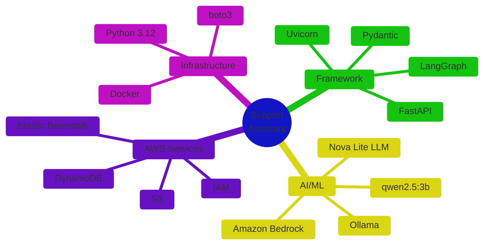

### Key Dependencies

| Package | Purpose |
|---------|---------|
| `fastapi` | Web framework |
| `langgraph` | Workflow orchestration |
| `pydantic` | Data validation |
| `pydantic-settings` | Configuration management |
| `boto3` | AWS SDK |
| `uvicorn` | ASGI server |

---

## 📈 Performance Characteristics

| Metric | Target | Description |
|--------|--------|-------------|
| **Latency (P50)** | < 2s | Typical response time |
| **Latency (P99)** | < 5s | With full retrieval pipeline |
| **Retrieval Limit** | 25 docs | Initial KB retrieval |
| **Rerank Limit** | 8 docs | Post-reranking |
| **Final Evidence** | 5 docs | Used in answer generation |
| **Context Window** | 4 messages | Recent conversation history |
| **Max Message Size** | 8000 chars | Input message limit |
| **Max Output Tokens** | 800 | LLM response limit |

---

## 🎨 Design Principles

1. **Deterministic First** - Use pattern matching before AI for predictable, fast behavior
2. **Graceful Degradation** - Local LLM → Cloud LLM → Deterministic fallback chain
3. **Evidence-Based** - All answers must be grounded in retrieved knowledge
4. **Security by Default** - Treat all external content as untrusted
5. **Observable** - Comprehensive structured logging at every pipeline stage
6. **Configurable** - Environment-based configuration for all thresholds
7. **Stateful Conversations** - Maintain context across multi-turn interactions
8. **Separation of Concerns** - Request context for filtering, stored issue for memory

---

## 🔍 Observability

### Structured Logging Events

| Event | Description |
|-------|-------------|
| `assistant_workflow_started` | Workflow invocation begins |
| `conversation_loaded` | Conversation state retrieved |
| `input_guardrail_allowed` | Input validation passed |
| `query_understanding_completed` | Query analysis finished |
| `knowledge_base_retrieval_request` | KB query initiated |
| `knowledge_base_retrieval_completed` | KB results received |
| `knowledge_base_results_reranked` | Reranking completed |
| `knowledge_base_results_validated` | Evidence validation done |
| `llm_generation_started` | Answer generation begins |
| `llm_generation_completed` | Answer generated |
| `conversation_updated` | State persisted |
| `assistant_workflow_completed` | Full pipeline finished |

### Log Fields

Every log event includes:
- `request_id` - Unique request identifier
- `conversation_id` - Conversation identifier
- `timestamp` - Event timestamp

---

## 📚 Related Documentation

- [README.md](README.md) - Quick start guide
- [Dockerfile](Dockerfile) - Container configuration
- [pyproject.toml](pyproject.toml) - Project metadata

---

*Documentation generated for Support Assistant Service v0.1.0*
